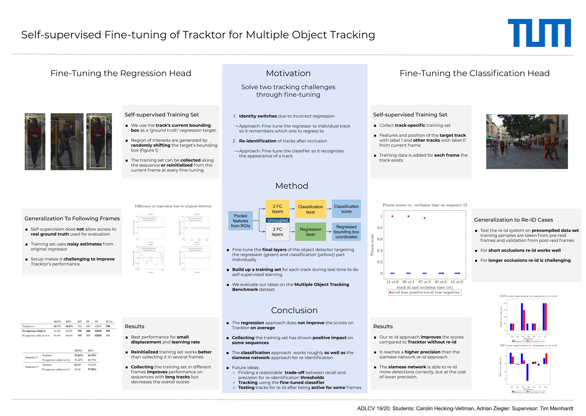

## ADL4CV project (IN-2364) with @CHeckingV

This repository is a fork of [Tracktor](https://github.com/phil-bergmann/tracking_wo_bnw). Tracktor is a tracking-by-detection framework that achieved state-of-the-art on the multiple object tracking benchmark. The method was published at ICCV 2019. <br>
The cool thing about using an object detector for tracking is that it doesn't require tracking data. However, the original method also used a separate siamese network for reidentification that *was* trained on tracking ground-truth data. 

Our project makes the usage of a siamese network redundant. Instead, we fine-tune the object detector to each track through self-supervised learning. This makes Tracktor fully independent of tracking data and improves its applicability. Our experiments show that self-supervision works as well as a siamese network for reidentification :tada:.


You can also have a look at the [report](https://github.com/MkuuWaUjinga/Self-Supervised-Learning-for-Tracktor/blob/master/report.pdf) for more details.

### Installation

1. Clone and enter this repository:
  ```
  git clone https://github.com/phil-bergmann/tracking_wo_bnw
  cd tracking_wo_bnw
  ```

2. Install packages for Python 3.7 in [virtualenv](https://uoa-eresearch.github.io/eresearch-cookbook/recipe/2014/11/26/python-virtual-env/):
    1. `pip3 install -r requirements.txt`
    2. Install Tracktor: `pip3 install -e .`

3. MOTChallenge data:
    1. Download [MOT17Det](https://motchallenge.net/data/MOT17Det.zip), [MOT16Labels](https://motchallenge.net/data/MOT16Labels.zip), [2DMOT2015](https://motchallenge.net/data/2DMOT2015.zip), [MOT16-det-dpm-raw](https://motchallenge.net/data/MOT16-det-dpm-raw.zip) and [MOT17Labels](https://motchallenge.net/data/MOT17Labels.zip) and place them in the `data` folder. As the images are the same for MOT17Det, MOT17 and MOT16 we only need one set of images for all three benchmarks.
    2. Unzip all the data by executing:
    ```
    unzip -d MOT17Det MOT17Det.zip
    unzip -d MOT16Labels MOT16Labels.zip
    unzip -d 2DMOT2015 2DMOT2015.zip
    unzip -d MOT16-det-dpm-raw MOT16-det-dpm-raw.zip
    unzip -d MOT17Labels MOT17Labels.zip
    ```

4. Download object detector and re-identifiaction Siamese network weights and MOTChallenge result files:
    1. Download zip file from [here](https://vision.in.tum.de/webshare/u/meinhard/tracking_wo_bnw-output_v2.zip).
    2. Extract in `output` directory.

### Experiments with fine-tuning

To run the experiment for classification go to the branch reproduce-classification and run the command

  ```
  python experiments/scripts/finetune_tacktor.py with cfg_classification
  ```

To run the experiment for regression go to the branch reproduce-regression and run the command

  ```
  python experiments/scripts/finetune_tacktor.py with cfg_regression
  python experiments/scripts/finetune_tacktor.py with cfg_regression_collect_training_set
  ```
